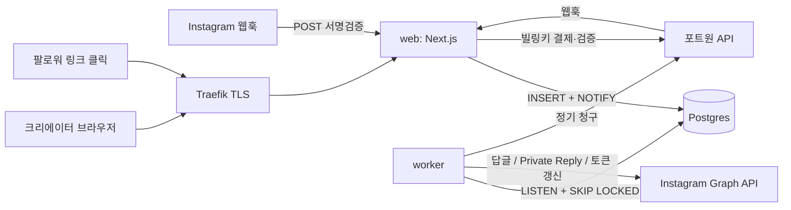

# 인스타그램 댓글 자동응답 서비스 — 설계 (MVP)

- 작성일: 2026-09-24
- 원본 PRD: https://claude.ai/code/artifact/d85fc834-d9f1-43d0-b5a4-82be95dfff3e
- 범위: PRD P0(F1~F6) + F7(링크 클릭 추적) + 정기결제 + 랜딩·법적 페이지·Meta 콜백

## 1. 목표와 성공 기준

크리에이터 게시물에 트리거 키워드 댓글이 달리면 공개 답글과 Private Reply DM(텍스트 + 링크 버튼)을 자동 발송한다.

이번 빌드가 끝났을 때 충족해야 하는 기준:

1. 가입 → 인스타 연동 → 자동화 생성 → 활성화가 모바일 웹에서 3분 안에 끝난다.
2. 키워드 댓글 웹훅 수신 → 답글·DM 발송 완료까지 p95 10초 이내 (레이트 리밋 대기분 제외).
3. 같은 댓글 웹훅이 여러 번 와도 발송은 1회 (comment_id 멱등), 같은 작성자·게시물·자동화에는 1회만 발송.
4. 계정별 Private Reply 한도(750회/시간)를 넘지 않으며, 초과분은 대기열에서 자동 발송되고 댓글 후 7일 초과분은 폐기된다.
5. Pro/Agency 플랜을 포트원 V2 빌링키로 결제하고 매월 자동 갱신된다. 실패 시 재시도 후 Free로 강등된다.
6. Meta 앱 검수 제출에 필요한 개인정보처리방침, 이용약관, 데이터 삭제 콜백, 연결 해제 콜백이 동작한다.
7. VPS에서 Docker Compose로 구동되고, main 브랜치 push 시 GitHub Actions가 자동 배포한다.

범위 밖: F8~F13(팔로우 조건, 다단계 DM, 리드 CSV, 스토리·라이브, 팀 권한, AI 답글), 카카오 알림톡, 비례 환불(proration).

## 2. 기술 스택

| 영역 | 선택 | 비고 |
|---|---|---|
| 웹 | Next.js 16 (App Router, `output: "standalone"`), React 19, TypeScript | 미들웨어는 `proxy.ts` 규칙 |
| UI | Tailwind CSS v4 + shadcn/ui | 모바일 우선 |
| DB | PostgreSQL 17 (VPS Docker) | |
| ORM | Drizzle ORM + drizzle-kit | 마이그레이션 SQL을 저장소에 커밋 |
| DB 드라이버 | `postgres` (postgres.js) | LISTEN/NOTIFY 지원 |
| 인증 | Better Auth (Drizzle 어댑터) | 카카오·구글 소셜 로그인 + 이메일 매직링크 |
| 이메일 | Resend | 매직링크, 토큰 만료·결제 실패 알림 |
| 결제 | 포트원 V2 (`@portone/browser-sdk`, `@portone/server-sdk`) | 빌링키 정기결제 |
| 검증 | zod | 모든 외부 입력 |
| 테스트 | Vitest | 단위 + 실제 Postgres 통합 |
| 배포 | Docker Compose + 기존 Traefik + GitHub Actions → GHCR | |

## 3. 시스템 구성



컨테이너(docker-compose, 이미지 1개로 web·worker·migrate 역할 분리):

| 서비스 | 역할 | 네트워크 |
|---|---|---|
| `postgres` | Postgres 17, 볼륨 `pgdata` | 내부 전용 |
| `migrate` | 기동 시 1회 마이그레이션 적용 후 종료 | 내부 |
| `web` | Next.js 서버 :3000, Traefik 라벨 | 내부 + Traefik 외부 네트워크 |
| `worker` | 큐 처리 + 주기 작업 | 내부 |
| `backup` | 매일 `pg_dump` → `/backups`, 7일 보관 | 내부 |

Traefik 라우팅은 라벨로 한다. 네트워크 이름, entrypoint, certresolver 이름은 `.env`의 `TRAEFIK_NETWORK`, `TRAEFIK_ENTRYPOINT`, `TRAEFIK_CERTRESOLVER`로 받는다.

## 4. 디렉터리 구조

```
src/
  app/
    (marketing)/            랜딩 /, /pricing, /terms, /privacy, /refund
    (auth)/login/           로그인
    app/                    인증 필요 영역 (/app/...)
      page.tsx              대시보드
      onboarding/           인스타 연동 + 프로페셔널 계정 가이드
      automations/          목록, new(위자드), [id](상세·수정)
      billing/              플랜·결제, complete(모바일 리다이렉트 복귀)
      settings/             계정 연결 해제, 탈퇴
    api/
      auth/[...all]/        Better Auth 핸들러
      instagram/connect/    OAuth 시작
      instagram/callback/   OAuth 콜백
      webhooks/instagram/   GET 검증 + POST 수신
      webhooks/portone/     결제 웹훅
      meta/deauthorize/     연결 해제 콜백
      meta/data-deletion/   데이터 삭제 콜백
      billing/subscribe/    빌링키 등록 + 첫 결제
      billing/cancel/       해지 예약
      health/               헬스체크
    l/[code]/               단축 링크 리다이렉트 (F7)
    data-deletion/[code]/   삭제 요청 상태 페이지
  server/                   서버 전용 도메인 로직 ("server-only")
    db/                     schema.ts, client.ts, migrate.ts
    auth.ts                 Better Auth 인스턴스
    env.ts                  zod 환경변수 검증
    crypto.ts               AES-256-GCM
    instagram/              graph.ts(API 클라이언트), oauth.ts, webhook.ts, errors.ts
    automations/            matcher.ts, repo.ts
    queue/                  events.ts(적재·선점·완료), backoff.ts
    pipeline/               process-comment.ts
    ratelimit.ts            계정별 슬라이딩 윈도 + 발송 간격
    links.ts                단축 코드 생성·조회
    usage.ts                월 DM 사용량
    billing/                plans.ts, portone.ts, subscriptions.ts
    email.ts
  worker/                   index.ts(진입점), loop.ts, scheduler.ts
  components/               ui(shadcn), 기능 컴포넌트
  lib/                      site.ts(서비스명·사업자정보), utils
drizzle/                    생성된 마이그레이션 SQL
scripts/                    simulate-comment.ts (서명된 가짜 웹훅 전송)
tests/                      unit/, integration/
deploy/                     docker-compose.yml, .env.example, backup.sh
docs/runbook.md             Meta 앱·포트원·VPS 설정, 수동 E2E 절차
.github/workflows/          ci.yml, deploy.yml
```

## 5. 데이터 모델

Better Auth 기본 테이블(`user`, `session`, `account`, `verification`)은 Better Auth 스키마를 그대로 쓴다. 이하는 서비스 테이블이다. 모든 PK는 `uuid` (`gen_random_uuid()`), 시각은 `timestamptz`.

### `ig_accounts`
| 컬럼 | 타입 | 설명 |
|---|---|---|
| id | uuid PK | |
| user_id | text FK→user.id | 소유자 |
| ig_user_id | text UNIQUE | 프로페셔널 계정 ID (`/me`의 `user_id`, 웹훅 `entry.id`와 동일) |
| ig_scoped_id | text | 앱 범위 ID (`/me`의 `id`). 데이터 삭제 콜백의 `user_id` 매칭용 |
| username | text | |
| profile_picture_url | text null | |
| account_type | text | BUSINESS / MEDIA_CREATOR |
| access_token_enc | text | AES-256-GCM 암호문 |
| token_expires_at | timestamptz | |
| status | text | `active` / `reauth_required` / `disconnected` |
| next_reply_at | timestamptz | 발송 간격(지터) 예약 슬롯 |
| dm_format | text | `button`(기본) / `text`. 버튼 템플릿 거부 시 `text`로 전환 |
| created_at, updated_at | timestamptz | |

`ig_user_id` UNIQUE: 한 인스타 계정은 한 사용자에게만 연결된다. 다른 사용자가 이미 연결한 계정을 연동하면 오류를 보여준다.

### `automations`
| 컬럼 | 타입 | 설명 |
|---|---|---|
| id | uuid PK | |
| user_id | text FK | |
| ig_account_id | uuid FK | |
| name | text | |
| media_scope | text | `specific` / `all` / `next` |
| media_id | text null | `specific`일 때 대상, `next`는 첫 매칭 시 바인딩 |
| media_thumbnail_url, media_permalink, media_caption | text null | 목록 표시용 캐시 |
| keywords | text[] | 1개 이상 |
| match_type | text | `contains` / `exact` |
| reply_enabled | boolean | |
| reply_texts | text[] | 답글 문구. 활성화 시 1~5개(3개 이상 권장 경고) |
| dm_text | text | DM 본문 (최대 640자) |
| dm_button_title | text | 버튼 라벨 (최대 20자) |
| dm_link_url | text | https URL |
| is_active | boolean | |
| created_at, updated_at | timestamptz | |

`next` 스코프: `media_id`가 비어 있으면, 댓글이 달린 게시물의 게시 시각이 자동화 생성 시각 이후일 때 그 게시물로 바인딩하고 `media_scope`를 `specific`으로 바꾼다. 게시 시각은 `media_cache`에서 조회하고 없으면 Graph API로 가져와 캐시한다.

### `media_cache`
`media_id` PK, `ig_account_id`, `timestamp`, `permalink`, `thumbnail_url`, `caption`, `media_product_type`, `fetched_at`.

### `comment_events` (PRD의 Event, 큐 역할 겸함)
| 컬럼 | 타입 | 설명 |
|---|---|---|
| id | uuid PK | |
| ig_account_id | uuid FK | |
| automation_id | uuid null | 매칭된 자동화 |
| comment_id | text UNIQUE | 멱등 키 |
| media_id | text | |
| parent_comment_id | text null | 대댓글이면 부모 댓글 ID |
| media_product_type | text null | FEED / REELS / AD 등 |
| commenter_ig_id | text | |
| commenter_username | text null | |
| comment_text | text | |
| received_at | timestamptz | 웹훅 수신 시각 (7일 만료 기준) |
| status | text | `pending` / `processing` / `succeeded` / `partial` / `failed` / `skipped` / `expired` |
| skip_reason | text null | `self` / `no_match` / `duplicate` / `quota` / `account_inactive` |
| reply_status, dm_status | text null | `sent` / `failed` / `skipped` |
| reply_comment_id | text null | 우리가 단 답글 ID |
| dm_message_id | text null | |
| error_code | text null | 최종 실패 사유 코드 |
| error_message | text null | |
| attempts | int default 0 | |
| usage_period | text null | 월 DM 사용량을 예약한 달(`YYYY-MM`, KST). null이면 미예약 |
| run_at | timestamptz | 다음 처리 가능 시각 |
| locked_at | timestamptz null | 선점 시각 (5분 초과 시 재선점) |
| dm_reserved_at | timestamptz null | 예약된 발송 슬롯 시각(7.5). 레이트 리밋 윈도 카운트 기준 |
| completed_at | timestamptz null | |
| created_at, updated_at | timestamptz | |

인덱스: `(status, run_at)` 부분 인덱스 `WHERE status IN ('pending','processing')`, `(ig_account_id, dm_reserved_at)`, `(automation_id, created_at)`.

상태 `partial`: 답글 또는 DM 중 하나만 성공. 대시보드에서는 실패 사유와 함께 표시한다.

### `deliveries` (F5 중복 방지 예약)
`id`, `automation_id`, `media_id`, `commenter_ig_id`, `event_id`, `created_at`. UNIQUE `(automation_id, media_id, commenter_ig_id)`.
발송 전에 `INSERT ... ON CONFLICT DO NOTHING`으로 예약한다. 삽입되지 않으면 `skipped/duplicate`. DM이 영구 실패하면 예약 행을 지워 같은 작성자의 다음 댓글이 다시 시도될 수 있게 한다.

### `links` (F7)
`id`, `code` UNIQUE(base62 7자), `automation_id`, `event_id`, `target_url`, `click_count` int, `first_clicked_at`, `last_clicked_at`, `created_at`.
Pro 이상 플랜에서만 DM 링크를 `https://{도메인}/l/{code}`로 감싼다. Free는 원본 URL을 그대로 쓴다.

### `usage_counters`
PK `(user_id, period)`. `period`는 KST 기준 `YYYY-MM`, `dm_count` int.
DM 발송 전 `UPDATE ... SET dm_count = dm_count + 1 WHERE dm_count < :limit RETURNING`(행이 없으면 먼저 upsert)로 원자적으로 예약한다. 실패하면 `skipped/quota`, DM 발송이 실패하면 1 감소.

### `subscriptions`
| 컬럼 | 타입 | 설명 |
|---|---|---|
| id | uuid PK | |
| user_id | text UNIQUE | |
| plan | text | `free` / `pro` / `agency` |
| status | text | `active` / `past_due` / `canceled` |
| billing_key_enc | text null | 암호화된 포트원 빌링키 |
| card_label | text null | 표시용 (예: "신한 **** 1234") |
| customer_name, customer_phone | text null | 결제자 이름·휴대폰(PG 필수값, 갱신 결제 시 재사용) |
| billing_anchor_at | timestamptz null | 첫 결제 시각. 다음 기간 종료일을 `anchor + n개월`(KST 말일 보정)로 계산해 날짜 밀림을 막는다 |
| current_period_start, current_period_end | timestamptz null | |
| cancel_at_period_end | boolean | |
| pending_plan | text null | 기간 종료 시 전환할 하위 플랜 |
| retry_count | int | 갱신 결제 실패 횟수 |
| next_retry_at | timestamptz null | |
| created_at, updated_at | timestamptz | |

구독 행이 없으면 Free로 취급한다.

### `payments`
`id`, `user_id`, `subscription_id`, `payment_id` UNIQUE(포트원 paymentId), `plan`, `amount` int, `status`(`pending`/`paid`/`failed`/`canceled`), `failure_reason`, `period_start`, `period_end`, `paid_at`, `created_at`, `updated_at`.

### `data_deletion_requests`
`id`, `confirmation_code` UNIQUE, `ig_user_id`, `status`(`received`/`completed`), `created_at`, `completed_at`.

### `worker_heartbeats`
`worker_id` PK, `beat_at`. `/api/health`가 마지막 하트비트가 60초 이내인지 확인한다.

## 6. 플랜

`src/server/billing/plans.ts`에 단일 소스로 정의한다.

| 플랜 | 월 요금(원, VAT 포함) | 인스타 계정 | 활성 자동화 | 월 DM | 링크 추적 | DM 하단 브랜드 문구 |
|---|---|---|---|---|---|---|
| free | 0 | 1 | 1 | 300 | 아니오 | 예 |
| pro | 9,900 | 1 | 무제한 | 10,000 | 예 | 아니오 |
| agency | 59,000 | 5 | 무제한 | 50,000 | 예 | 아니오 |

하위 플랜으로 내려가면 한도를 넘는 활성 자동화는 최근 수정 순으로 1개만 남기고 비활성화하고, 초과 인스타 계정의 자동화도 비활성화한다. 사용자에게 이메일로 알린다.

## 7. 핵심 흐름

### 7.1 인스타 연동 (F1)
1. `/api/instagram/connect`: 로그인 세션을 확인한다. `state`(랜덤 32바이트)를 HttpOnly 쿠키에 저장하고 Instagram 인가 URL로 리다이렉트한다.
2. `/api/instagram/callback`:
   - `state`를 검증하고 code로 단기 토큰을 교환한 뒤, 장기 토큰(60일)으로 교환한다.
   - `/me`를 조회하고 `account_type`을 확인한다. 프로페셔널 계정이 아니면 온보딩의 전환 가이드로 보낸다.
   - 플랜의 계정 수 한도를 확인한 뒤 `ig_accounts`를 upsert(토큰 암호화)한다.
   - `subscribed_apps`에 `comments`를 구독하고 온보딩 다음 단계로 이동한다. `messages` 구독은 P1(F8·F9)에서 추가한다.
   - ID 처리: 토큰 교환 응답은 `{data:[{...}]}`와 평면 객체 두 형태 모두 파싱한다. 숫자 ID는 2^53을 넘을 수 있으므로 파싱 전에 문자열로 치환하고, 정식 ID는 `/me`의 `user_id`를 쓴다.
   - 사용자가 인가를 취소하면(`error=access_denied`) 온보딩으로 돌아가 안내한다.
3. 토큰 갱신: 워커가 1시간마다 `token_expires_at < now()+7일`인 계정을 갱신한다. 실패하거나 권한이 철회된 경우 `reauth_required`로 바꾸고 이메일로 알린다. 대시보드에는 재연결 배너를 띄운다.

### 7.2 웹훅 수신
`POST /api/webhooks/instagram`:
1. raw body로 `X-Hub-Signature-256`(`sha256=<hex>`, HMAC-SHA256)을 timing-safe로 비교한다. 문서가 모호하므로 `IG_APP_SECRET`으로 먼저, 설정돼 있으면 `META_APP_SECRET`으로도 검증한다. 둘 다 불일치면 401.
2. 방어적으로 파싱한다.
   - `entry[].changes[]`와 `entry[].field/value` 두 형태를 모두 받는다.
   - 댓글 ID는 `value.id ?? value.comment_id`다.
   - `field == "comments"`만 처리하고 `messaging` 등 나머지는 무시한다.
   - 각 댓글마다 `entry.id`로 활성 `ig_accounts`를 찾고, 없으면 무시한다.
   - `parent_id`와 `media.media_product_type`은 함께 저장한다.
   - 한 요청에 최대 1000건이 올 수 있으므로 한 번의 다중 행 INSERT로 적재한다.
   - Meta는 최대 36시간 재전송하므로 멱등 적재에 의존한다.
3. `comment_events`에 `INSERT ... ON CONFLICT (comment_id) DO NOTHING`한다(status `pending`, `run_at = now()`).
4. `NOTIFY comment_events`를 보내고 200을 반환한다. 모든 처리는 1초 안에 끝나야 한다.

`GET`은 `hub.verify_token`을 비교한 뒤 `hub.challenge`를 그대로 반환한다.

### 7.3 워커 루프
- 시작 시 `LISTEN comment_events`. 알림 또는 2초 타이머에 깨어나 선점한다.
  ```sql
  UPDATE comment_events SET status='processing', locked_at=now(), attempts=attempts+1
  WHERE id IN (
    SELECT id FROM comment_events
    WHERE (status='pending' AND run_at<=now())
       OR (status='processing' AND locked_at < now()-interval '5 minutes')
    ORDER BY run_at LIMIT :batch FOR UPDATE SKIP LOCKED)
  RETURNING *
  ```
- 동시 처리 수는 `WORKER_CONCURRENCY`(기본 8)로 제한한다. SIGTERM을 받으면 선점을 멈추고 진행 중인 작업을 마친 뒤 종료한다.
- 10초마다 `worker_heartbeats`를 갱신한다.

### 7.4 댓글 처리 파이프라인 (F2~F5)
`processComment(event)`는 순서대로 판정하고, 각 단계의 결과를 `comment_events`에 기록한다.

1. **만료**: `received_at < now()-7일`이면 `expired`.
2. **계정 상태**: `ig_accounts.status != active`이면 `skipped/account_inactive`.
3. **본인 댓글**: 다음 중 하나면 `skipped/self`다. 우리 답글이 웹훅으로 되돌아오는 무한 루프를 막기 위한 필수 단계다.
   - `commenter_ig_id == ig_user_id`
   - `commenter_username == username`
   - `comment_id`가 어떤 이벤트의 `reply_comment_id`와 같음
4. **규칙 매칭**: 해당 계정의 활성 자동화 중 대상 게시물이 맞고(`specific` 일치 → `next` 바인딩 → `all` 순, 같은 스코프 안에서는 최근 생성순) 키워드가 매칭되는 첫 자동화를 고른다. 없으면 `skipped/no_match`.
   - 정규화: NFKC, 소문자, 앞뒤 공백 제거, 연속 공백 1개로.
   - `contains`: 정규화한 댓글이 키워드를 포함하는지 본다.
   - `exact`: 정규화한 댓글 전체가 키워드와 같은지 보되, 끝의 구두점·이모지는 제거하고 비교한다.
5. **중복**: `deliveries`에 예약한다. 이미 이 이벤트의 예약(`event_id` 일치)이 있으면 통과한다. 다른 이벤트가 선점했으면 `skipped/duplicate`.
6. **사용량**: `usage_period`가 비어 있을 때만 `usage_counters`에서 DM 1건을 예약하고, 예약한 월(`YYYY-MM`)을 `usage_period`에 저장한다. 월을 넘겨 연기돼도 정확한 달에서 해제하기 위해서다. 한도 초과면 `skipped/quota`로 끝내고 `deliveries` 예약을 삭제한다.
7. **레이트 리밋·간격**: `dm_reserved_at`이 없으면 `reserveSendSlot`(7.5)으로 슬롯을 예약한다. 슬롯이 5초 넘게 남았으면 `status=pending, run_at=슬롯`으로 되돌린다.
   - 중복·사용량 예약은 유지한다.
   - 이벤트가 최종적으로 `failed`/`expired`가 되면, DM이 발송되지 않은 경우에 한해 두 예약을 해제한다(`deliveries` 삭제, 사용량 1 감소).
8. **공개 답글**(`reply_enabled`일 때): `reply_texts`에서 무작위로 고르고 `{username}`을 `@사용자명`으로 치환해 발송한다.
   - Instagram은 최상위 댓글에만 답글을 허용한다. 대댓글이면 `parent_comment_id`에 답글을 단다.
   - 응답의 답글 ID를 `reply_comment_id`에 저장한다.
9. **DM**: Private Reply(`recipient.comment_id`)로 발송한다. 댓글당 1통, 댓글 후 7일 이내라는 제약이 있다.
   - Pro 이상이면 `links` 행을 만들고 URL을 단축 링크로 바꾼다. Free는 원본 URL을 쓰고 본문 끝에 브랜드 문구를 붙인다.
   - 1차 시도는 버튼 템플릿(`template_type: "button"`, text ≤ 640자, `web_url` 버튼 1개)이다.
   - Private Reply에서 템플릿 지원 여부는 공식 문서로 확인되지 않았다. 그래서 `invalid_message`로 분류되는 오류(예: 100/2534015)가 나면 같은 요청 안에서 텍스트 폴백(`본문\n\n버튼라벨: URL`, UTF-8 1000바이트 이내)으로 한 번 재시도한다.
   - 폴백에 성공한 계정은 `ig_accounts.dm_format = 'text'`로 기억해 이후 바로 텍스트로 보낸다.
10. **결과 기록**: 둘 다 성공이면 `succeeded`, 하나만 성공이면 `partial`이다. 오류 분류(7.6)에 따라 재시도하거나 `failed`로 기록한다.

답글과 DM은 독립적으로 기록한다. 재시도할 때는 이미 성공한 쪽을 다시 보내지 않는다(`reply_status`/`dm_status` 확인).

### 7.5 레이트 리밋과 발송 간격
이벤트마다 고유한 발송 시각(슬롯)을 한 번 예약한다. 예약한 슬롯은 `dm_reserved_at`에 저장한다(미래 시각일 수 있다). 3,000건이 몰려도 이벤트마다 선점·연기가 1번씩만 일어난다.

`reserveSendSlot(igAccountId, eventId, now)`는 하나의 트랜잭션 안에서 다음을 한다.
1. `pg_advisory_xact_lock(hashtext('ig-send:' || id))`로 계정별 직렬화한다.
2. 슬롯 후보 `t = max(now, ig_accounts.next_reply_at)`(발송 간격).
3. 시간당 한도: 윈도 `dm_reserved_at > now - 1시간`의 예약을 최신순으로 정렬해 `IG_PRIVATE_REPLY_HOURLY_LIMIT`(기본 700, 한도 750에서 여유분을 뺀 값)번째 행을 본다. 그 행이 있으면 `t = max(t, 그 시각 + 1시간)`. 슬롯은 단조 증가하므로 이 조건만으로 어떤 1시간 구간에도 예약이 한도를 넘지 않는다.
4. `next_reply_at = t + 무작위(1.0~3.0초)`, 이벤트 `dm_reserved_at = t`로 저장하고 `t`를 반환한다.

파이프라인은 `dm_reserved_at`이 이미 있으면 재예약하지 않는다.
- `t - now ≤ 5초`이면 워커가 `t`까지 대기한 뒤 발송한다.
- `t - now > 5초`이면 `status=pending, run_at=t`로 큐에 돌려보낸다. 다른 계정의 이벤트가 밀리지 않게 하기 위해서다.
- `t`가 `received_at + 7일`을 넘으면 즉시 `expired`로 처리한다.
- 일시 오류로 재시도할 때는 `dm_reserved_at`을 비워 새 슬롯을 받는다. 실패한 호출은 카운트에서 빠지지만 한도 여유분(50)이 이를 흡수한다.

대시보드의 "발송 대기 N건"은 `status='pending' AND automation_id IS NOT NULL AND run_at > now()` 건수다.

### 7.6 오류 분류와 재시도
Graph API 오류(`error.code`, `error.error_subcode`)를 분류한다. 구현은 `src/server/instagram/errors.ts`, 표는 부록 A.4.
- **rate_limited** (4, 17, 32, 613, 80002): 재시도하되 `attempts`를 늘리지 않고 5분 뒤로 연기한다.
- **transient** (HTTP 5xx, 네트워크 오류·타임아웃, code 1, 2): 지수 백오프(30초 × 2^(attempts-1), 최대 5회, ±20% 지터)로 재시도한다.
- **auth** (190): 계정을 `reauth_required`로 바꾸고 이벤트는 `failed`로 기록한다. 재연결을 안내한다.
- **invalid_message** (100/2534015): DM 텍스트 폴백 트리거(7.4-9). 폴백도 실패하면 `permanent`로 처리한다.
- **permanent** (10/2534022·10/2018278 창 만료, 100/2534025 유효하지 않은 댓글, 100/2534014, 551 수신 불가, 200/2534041 DM 차단, 그 밖의 4xx): 즉시 `failed`로 기록하고 `error_code`에 `code/subcode`를 저장한다.

대시보드에는 코드 대신 한국어 사유를 보여준다(예: "상대방이 메시지를 받을 수 없는 상태", "발송 가능 시간(7일) 초과").

5회를 넘기면 `failed`. 재시도가 7일 만료를 넘기게 되면 `expired`.

### 7.7 링크 클릭 (F7)
`GET /l/[code]`: 코드를 조회해 `click_count+1`, `first_clicked_at`(없을 때만), `last_clicked_at`을 갱신하고 302로 `target_url`에 보낸다. 없는 코드는 404 페이지. 봇 UA(facebookexternalhit 등 링크 미리보기 크롤러)는 집계하지 않는다.

### 7.8 결제 (포트원 V2)
1. **플랜 선택**: `/app/billing`에서 플랜과 결제자 정보(이름, 휴대폰)를 받는다. 이메일은 계정 이메일을 쓴다. 이 정보로 브라우저 SDK `requestIssueBillingKey`를 호출해 카드 빌링키를 발급한다.
   - 요청 값: `billingKeyMethod:"CARD"`, `issueId`(ASCII), `issueName`, `customer{customerId, fullName, phoneNumber, email}`, `offerPeriod{interval:"1m"}`, `redirectUrl`.
   - KG이니시스는 이름·휴대폰·이메일이 필수라서 항상 받는다.
   - 모바일은 `redirectUrl=/app/billing/complete?plan=...`로 돌아오고, 쿼리의 `billingKey`/`code`/`message`를 읽는다.
2. **`POST /api/billing/subscribe` {plan, billingKey}**
   - 서버가 `GET /billing-keys/{billingKey}`로 `status == ISSUED`이고 `customer.id == user.id`인지 검증한다.
   - `paymentId = sub_{subId8}_{YYYYMMDD}_{attempt}` 형식(`[A-Za-z0-9_-]` 6~40자)으로 `payments`에 `pending` 행을 만들고, 빌링키로 즉시 결제한다.
   - 결제 응답과 결제 조회(`GET /payments/{id}`)로 `PAID`를 확인한다.
   - 확인되면 구독을 활성화한다: `current_period_end` = 지금 + 1개월(말일 보정), 빌링키 암호화 저장.
   - 기존 유료 구독이 있으면 기존 빌링키를 삭제한다.
3. **업그레이드**(pro→agency): 즉시 새 플랜 금액을 결제하고 새 기간을 시작한다. 비례 환불은 하지 않으며 가격 페이지에 명시한다.
   **다운그레이드**(agency→pro): `pending_plan`에 저장하고 기간 종료 시 적용한다.
4. **갱신**: 워커가 10분마다 `status=active AND current_period_end <= now()`인 구독을 처리한다.
   - `cancel_at_period_end`이면 Free로 강등하고 빌링키를 삭제한다.
   - 아니면 (`pending_plan` 적용 후) 빌링키로 결제한다. 성공하면 기간을 연장한다.
   - 실패하면 `past_due`, `retry_count+1`, `next_retry_at`을 +1일로 둔다.
   - `past_due` 구독은 `next_retry_at`이 되면 재시도한다. 3회 실패하면 Free로 강등하고 빌링키를 삭제한다.
   - 실패할 때마다 이메일로 알린다. `past_due` 기간에도 유료 기능은 유지한다(유예).
5. **해지**: `POST /api/billing/cancel` → `cancel_at_period_end=true`. 기간 종료 전에는 되돌릴 수 있다.
6. **포트원 웹훅**: `POST /api/webhooks/portone`.
   - `Webhook.verify(secret, rawBody, Object.fromEntries(req.headers))`로 Standard Webhooks 서명을 검증한다.
   - `Transaction.Paid`/`Transaction.Failed`면 `GET /payments/{id}`로 재조회해 `payments` 상태를 맞춘다(첫 결제 응답 유실 대비). 금액(`amount.total`)도 대조한다.
   - 알 수 없는 type은 200으로 무시한다. 멱등하게 처리한다.
7. **동시성**: 같은 구독의 청구는 `pg_advisory_xact_lock`으로 직렬화한다. paymentId는 (기간 종료일, 시도 번호)로 결정적으로 만든다. 같은 시도가 두 번 실행돼도 포트원이 `ALREADY_PAID`(409)로 막으므로, 이 경우 결제 조회로 성공 처리한다.
8. **정기결제 주체**: 포트원 결제 예약 API 대신 워커가 직접 청구한다. 포트원도 실패 재시도는 가맹점이 구현하도록 안내하므로, 상태를 우리 DB 한 곳이 소유하는 편이 단순하다.
9. **테스트/라이브**:
   - 테스트는 포트원 콘솔의 테스트 채널(KG이니시스 `INIBillTst` 또는 토스페이먼츠 `iamporttest_4`)을 쓴다. 이니시스 테스트 결제는 실제로 승인된 뒤 당일 밤 자동 취소된다.
   - 라이브는 PG 정기결제 계약과 카드사 심사를 마친 뒤 채널 키만 바꾼다.

### 7.9 Meta 콜백
- **`signed_request` 검증 공통 규칙**
  - 형식: form POST `signed_request=<b64url(sig)>.<b64url(payload)>`. 서명은 `HMAC-SHA256(payload 세그먼트, secret)`이다.
  - 시크릿: `IG_APP_SECRET`, 그다음 `META_APP_SECRET` 순으로 검증한다.
  - 계정 매칭: payload의 `user_id`를 `ig_scoped_id` 또는 `ig_user_id`와 대조한다.
- **연결 해제**(`POST /api/meta/deauthorize`): 해당 계정을 `disconnected`로 바꾸고, 토큰을 삭제하고, 자동화를 비활성화한다. 200을 반환한다.
- **데이터 삭제**(`POST /api/meta/data-deletion`): 해당 IG 계정과 그 계정의 자동화·이벤트·링크를 삭제한다. 삭제 요청 행을 만들고 `{url: "{APP_URL}/data-deletion/{code}", confirmation_code}`를 반환한다.
- **사용자 탈퇴**(설정 > 탈퇴): 구독을 해지하고 빌링키를 삭제한 뒤 사용자와 연쇄 데이터를 삭제한다. 결제 기록(`payments`)은 전자상거래법상 5년 보관 대상이므로 `user_id`를 끊고 남긴다.

### 7.10 워커 주기 작업과 데이터 보존
`src/worker/scheduler.ts`가 간단한 인터벌 스케줄러로 실행한다. 같은 작업이 여러 워커에서 겹치지 않도록 `pg_try_advisory_lock`을 쓴다.

| 작업 | 주기 | 내용 |
|---|---|---|
| 토큰 갱신 | 1시간 | 7.1-3 |
| 구독 갱신·재시도 | 10분 | 7.8-4 |
| 만료 처리 | 10분 | `status=pending AND received_at < now()-7일` → `expired` + 예약 해제 |
| 데이터 정리 | 1시간 (삭제는 멱등) | `skip_reason IN ('no_match','self')` 이벤트는 3일 뒤 삭제. 나머지 이벤트는 180일 뒤 삭제. `links.event_id`는 ON DELETE SET NULL이라 링크는 계속 동작 |

개인정보처리방침의 보유기간은 이 표와 맞춘다.

## 8. 화면

모든 화면은 375px 폭을 기준으로 설계한다. 데스크톱에서는 최대 폭 컨테이너를 쓴다.

| 경로 | 내용 |
|---|---|
| `/` | 랜딩: 문제 → 동작 방식 3단계 → 기능 → 가격 요약 → FAQ → CTA. 푸터에 사업자 정보 |
| `/pricing` | 플랜 비교표, 결제·환불 정책 요약 |
| `/terms`, `/privacy`, `/refund` | 이용약관, 개인정보처리방침(수집 항목·목적·보유기간·처리위탁: Meta, 포트원/PG, Resend·파기·권리·책임자), 환불 정책 |
| `/login` | 카카오·구글 버튼 + 이메일 매직링크 |
| `/app/onboarding` | 1) 프로페셔널 계정 확인·전환 가이드 2) 인스타 연결 버튼 3) 첫 자동화 만들기로 이동 |
| `/app` | 대시보드: 연결 계정 상태, 이번 달 DM 사용량/한도, 발송 대기 N건, 자동화별 트리거·성공·부분·실패·클릭(Pro+) 카드, 최근 이벤트 20건(실패 사유 표시) |
| `/app/automations` | 목록 + 활성 토글 |
| `/app/automations/new` | 위자드 5단계: 게시물 선택(최근 게시물 그리드 / 전체 / 다음 게시물) → 키워드(칩 입력, 포함/일치) → 공개 답글 문구(최대 5개, 3개 미만이면 권장 경고, `{username}` 삽입 버튼) → DM(본문, 버튼 라벨, 링크) → 미리보기(DM 말풍선 목업) 후 활성화 |
| `/app/automations/[id]` | 수정 + 해당 자동화의 이벤트 목록 |
| `/app/billing` | 현재 플랜, 다음 결제일, 카드, 플랜 변경, 해지/해지 취소, 결제 내역 |
| `/app/settings` | 인스타 계정 목록·연결 해제·재연결, 회원 탈퇴 |
| `/data-deletion/[code]` | 삭제 요청 상태 |

사업자 정보(상호, 대표자, 사업자등록번호, 통신판매업 신고번호, 주소, 연락처)와 서비스명은 `src/lib/site.ts`에서 관리한다. 값은 운영자가 채운다. PG 심사와 Meta 검수 전에 반드시 입력해야 하며, 비어 있으면 빌드 시 경고한다.

## 9. 보안

- **토큰·빌링키**: AES-256-GCM, 키는 `ENCRYPTION_KEY`(32바이트 base64). 저장 형식은 `v1:{iv}:{tag}:{ciphertext}`(base64url)로, 키 교체에 대비한다.
- **웹훅**: Instagram은 HMAC 서명, 포트원은 Standard Webhooks 서명으로 검증한다. 둘 다 raw body 기준.
- **OAuth**: `state` 쿠키(HttpOnly, SameSite=Lax, 10분 만료).
- **권한**: RLS 없이 모든 조회·수정을 `userId` 스코프 함수로만 한다. 서버 액션과 라우트 핸들러는 세션을 확인한 뒤 zod로 입력을 검증한다.
- **입력 검증**: DM 링크는 `https://`만 허용하고, 우리 도메인 `/l/` 링크를 대상으로 하는 것(루프)은 금지한다.
- **HTTP 보안 헤더**: `next.config`의 headers에 HSTS, X-Content-Type-Options, Referrer-Policy, frame-ancestors none을 둔다.
- **로그**: 토큰·빌링키·이메일은 로그에 남기지 않는다.

## 10. 환경변수

`.env.example`에 모두 나열하고 `src/server/env.ts`에서 zod로 검증한다.
- **앱·DB:** `APP_URL`, `DATABASE_URL`
- **인증:** `BETTER_AUTH_SECRET`, `KAKAO_CLIENT_ID`, `KAKAO_CLIENT_SECRET`, `GOOGLE_CLIENT_ID`, `GOOGLE_CLIENT_SECRET`
- **이메일:** `RESEND_API_KEY`, `EMAIL_FROM`
- **Instagram:** `IG_APP_ID`, `IG_APP_SECRET`, `META_APP_SECRET`(선택, 서명 이중 검증용), `IG_WEBHOOK_VERIFY_TOKEN`, `IG_GRAPH_API_VERSION`(기본 `v26.0`), `IG_PRIVATE_REPLY_HOURLY_LIMIT`(기본 700)
- **암호화·워커:** `ENCRYPTION_KEY`, `WORKER_CONCURRENCY`
- **포트원:** `PORTONE_STORE_ID`, `PORTONE_CHANNEL_KEY`, `PORTONE_API_SECRET`, `PORTONE_WEBHOOK_SECRET`, `NEXT_PUBLIC_PORTONE_STORE_ID`, `NEXT_PUBLIC_PORTONE_CHANNEL_KEY`
- **배포 전용:** `APP_DOMAIN`, `TRAEFIK_NETWORK`, `TRAEFIK_ENTRYPOINT`, `TRAEFIK_CERTRESOLVER`, `POSTGRES_PASSWORD`, `IMAGE`

소셜 로그인 키가 비어 있으면 해당 버튼을 숨긴다(카카오 비즈앱 전환 전 개발 편의).

## 11. 배포

- **Dockerfile**(멀티스테이지, `node:24-alpine`):
  - deps → build(`next build` standalone, 워커와 마이그레이터를 esbuild로 `dist/`에 번들) → runtime(non-root).
  - 엔트리 커맨드: `web` = `node server.js`, `worker` = `node dist/worker.js`, `migrate` = `node dist/migrate.js`.
- **`deploy/docker-compose.yml`**:
  - `postgres`(healthcheck `pg_isready`), `migrate`(depends_on postgres healthy)
  - `web`, `worker`(depends_on migrate `service_completed_successfully`), `backup`
  - `web`만 외부 Traefik 네트워크에 붙는다.
- **CI**(`.github/workflows/ci.yml`, PR·push): typecheck, lint, 단위 테스트, Postgres 서비스 컨테이너로 통합 테스트.
- **배포**(`.github/workflows/deploy.yml`, main push):
  - CI 통과 후 이미지를 `ghcr.io/{owner}/{repo}:{sha}`와 `:latest`로 푸시한다.
  - SSH(`VPS_HOST`, `VPS_USER`, `VPS_SSH_KEY`)로 접속해 `IMAGE` 태그를 갱신하고 `docker compose pull && docker compose up -d`를 실행한다.
  - `/api/health` 응답을 확인한다.
- **VPS 준비**(1회, 문서화): 디렉터리 `/opt/{app}`, `.env` 작성, GHCR 로그인(read:packages 토큰), DNS A 레코드.
- **백업**: `backup.sh`가 매일 03:00 KST에 `pg_dump -Fc`를 실행하고 7일 보관한다. 외부 저장소 업로드는 선택(문서화만).

## 12. 테스트 전략

- **단위 테스트(Vitest, DB 없음)**
  - 키워드 정규화·매칭, 스코프 우선순위
  - 백오프 계산, 오류 분류
  - HMAC·signed_request 검증, AES-GCM 왕복, 단축 코드 생성
  - 플랜 한도, 기간 계산(말일 보정)
- **통합 테스트(Vitest + 실제 Postgres)**
  - 웹훅 → 적재 멱등성, 선점 동시성(두 워커가 같은 행을 잡지 않음)
  - 파이프라인 전체: `FakeGraphClient`로 성공, 부분 실패, rate_limited, permanent를 검증한다.
  - 중복 방지, 월 한도, 레이트 리밋 연기, 7일 만료, `next` 스코프 바인딩
  - 구독 갱신 성공, 실패 재시도, 강등(`FakePortOneClient`)
- **외부 의존성 주입**: Graph API와 포트원 클라이언트는 인터페이스로 정의하고 파이프라인과 구독 로직에 주입한다.
- **수동 E2E**: 앱에 역할(테스터)로 등록한 인스타 계정으로 Standard Access 상태에서 진행한다. 연동 → 자동화 → 실제 댓글 → 답글·DM 수신 → 링크 클릭 집계. 절차는 `docs/runbook.md`에 둔다.

## 부록 A. Instagram API 계약 (2026-09-24 확인)

Graph API 버전은 `v26.0`(2026-07-29 출시)이다. 호스트는 `https://graph.instagram.com/{version}`, OAuth 토큰 엔드포인트는 버전 없이 쓴다. 모든 호출은 `src/server/instagram/graph.ts`의 `GraphClient` 인터페이스 뒤에 둔다.

### A.1 OAuth
| 단계 | 요청 | 응답 |
|---|---|---|
| 인가 | `GET https://www.instagram.com/oauth/authorize?client_id={IG_APP_ID}&redirect_uri={APP_URL}/api/instagram/callback&response_type=code&scope=instagram_business_basic,instagram_business_manage_comments,instagram_business_manage_messages&state=…` | `?code=…#_` (끝의 `#_` 제거, 1시간 유효·1회용) 또는 `?error=access_denied` |
| 단기 토큰 | `POST https://api.instagram.com/oauth/access_token` form: `client_id, client_secret, grant_type=authorization_code, redirect_uri, code` | `{data:[{access_token, user_id, permissions}]}` 또는 평면 객체 |
| 장기 토큰 | `GET https://graph.instagram.com/access_token?grant_type=ig_exchange_token&client_secret=…&access_token=…` | `{access_token, token_type, expires_in}` (약 60일) |
| 갱신 | `GET https://graph.instagram.com/refresh_access_token?grant_type=ig_refresh_token&access_token=…` | 같은 형태. 발급 후 24시간 이상 지난 유효 토큰만 가능 |
| 프로필 | `GET /me?fields=id,user_id,username,account_type,profile_picture_url` | `id`=앱 범위 ID, `user_id`=프로페셔널 계정 ID. `account_type`은 `Business`/`Media_Creator` (대소문자 무시 비교) |
| 웹훅 구독 | `POST /{ig-user-id}/subscribed_apps?subscribed_fields=comments` | `{success:true}` |

### A.2 웹훅 `comments` 페이로드 (방어적 파싱 대상)
```json
{"object":"instagram","entry":[{"id":"17841400000000000","time":1758700000,
 "changes":[{"field":"comments","value":{
   "from":{"id":"1234567890123456","username":"commenter"},
   "media":{"id":"18012345678901234","media_product_type":"REELS"},
   "id":"18045678901234567","parent_id":"18040000000000000","text":"공구"}}]}]}
```
- 공개 계정만 댓글 알림을 받는다. 온보딩에서 안내한다.
- 광고 게시물 댓글은 중복으로 올 수 있어 `comment_id` 멱등에 의존한다.

### A.3 발송
- 공개 답글: `POST /{comment-id}/replies` body `{message}` → `{id}`.
  - 최상위 댓글에만 가능하다. 숨김 댓글이나 라이브 댓글에는 불가하다.
  - 문구 검증은 보수적으로 한다: 문구당 300자 이하, URL 0개, 해시태그 4개 이하.
- Private Reply: `POST /{ig-user-id}/messages`, 헤더 `Authorization: Bearer {token}` → `{recipient_id, message_id}`.
  - 버튼(1차):
    ```json
    {"recipient":{"comment_id":"…"},"message":{"attachment":{"type":"template","payload":{"template_type":"button","text":"…","buttons":[{"type":"web_url","url":"https://…","title":"…"}]}}}}
    ```
  - 텍스트(폴백): `{"recipient":{"comment_id":"…"},"message":{"text":"…"}}`
- 한도(계정당): Private Reply는 게시물·릴스 합계 750회/시간이다. Send API는 100회/초다.
- 게시물 목록: `GET /{ig-user-id}/media?fields=id,caption,media_type,media_product_type,thumbnail_url,media_url,permalink,timestamp&limit=24` (커서 페이징). `caption`, `media_product_type`, `thumbnail_url`은 없을 수 있다.

### A.4 오류 코드 분류
| code / subcode | 의미 | 분류 |
|---|---|---|
| 4, 17, 32, 613(/2534040), 80002 | 요청 한도 초과 | rate_limited |
| 1, 2, HTTP 5xx, 네트워크 | 일시 오류 | transient |
| 190 | 토큰 무효·만료 | auth |
| 100/2534015 | 메시지 데이터 무효 | invalid_message |
| 10/2534022, 10/2018278 | 발송 가능 창 밖 | permanent |
| 100/2534025 | 유효하지 않은 댓글(이미 답장했거나 삭제 추정) | permanent |
| 100/2534014 | 대상 사용자 없음 | permanent |
| 551(/1545041) | 수신 불가 상태 | permanent |
| 200/2534041 | 계정 DM 접근 차단 | permanent |
| 10, 200 (그 외) | 권한 없음 | permanent |

### A.5 앱 검수·개발 환경
- 앱은 Business 유형이어야 한다. Advanced Access(`instagram_business_basic`, `…_manage_comments`, `…_manage_messages`)를 받으려면 비즈니스 인증과 권한별 영문 UI 시연 영상이 필요하다. 권한마다 성공한 API 호출이 1회 이상 있어야 한다.
- 댓글 웹훅은 앱이 Live 상태이고 Advanced Access를 받아야 전달될 수 있다(Standard Access에서 역할 계정으로 수신되는지는 미확인). 개발 중 검증 방법:
  1. 대시보드의 웹훅 "Test" 전송
  2. `scripts/simulate-comment.ts`: 로컬·스테이징에서 `IG_APP_SECRET`으로 서명한 가짜 `comments` 웹훅을 보낸다. 실제 발송까지 확인하려면 역할 계정 게시물의 실제 comment_id를 인자로 준다.
- 출처:
  - https://developers.facebook.com/docs/instagram-platform/instagram-api-with-instagram-login/business-login
  - https://developers.facebook.com/docs/instagram-platform/webhooks
  - https://developers.facebook.com/docs/instagram-platform/private-replies
  - https://developers.facebook.com/docs/instagram-platform/instagram-api-with-instagram-login/messaging-api
  - https://developers.facebook.com/docs/messenger-platform/error-codes
  - https://developers.facebook.com/docs/development/create-an-app/app-dashboard/data-deletion-callback
  - https://developers.facebook.com/docs/graph-api/changelog/versions

## 부록 B. 포트원 V2 계약 (2026-09-24 확인, REST OpenAPI v1.16.0, `@portone/server-sdk` 0.19.0)

- REST 기본 URL `https://api.portone.io`, 헤더 `Authorization: PortOne {PORTONE_API_SECRET}`. 서버 SDK는 `PortOneClient({ secret })`.
- 빌링키 결제: `portone.payment.payWithBillingKey({ paymentId, billingKey, orderName, customer: { id, name: { full }, email, phoneNumber }, amount: { total }, currency: "KRW" })`. 실패 시 예외(`e.data.type`: `ALREADY_PAID`, `PG_PROVIDER` 등)가 난다.
- 결제 조회: `portone.payment.getPayment({ paymentId })` → `status`: `READY | PENDING | PAID | FAILED | CANCELLED | PARTIAL_CANCELLED | VIRTUAL_ACCOUNT_ISSUED`.
- 빌링키 조회·삭제: `portone.payment.billingKey.getBillingKeyInfo({ billingKey })` (`status: ISSUED | DELETED`, `customer`), `portone.payment.billingKey.deleteBillingKey({ billingKey })`.
- 웹훅: 버전 `2024-04-25`(Standard Webhooks). 헤더는 `webhook-id`, `webhook-timestamp`, `webhook-signature`, 바디는 `{ type, timestamp, data: { storeId, paymentId?, transactionId?, billingKey? } }`. 실패하면 최대 5회 재전송된다.
- 금액은 정수 KRW다. `vat`를 생략하면 자동 계산된다.
- 출처: https://developers.portone.io/opi/ko/integration/start/v2/billing/issue?v=v2 , https://developers.portone.io/opi/ko/integration/start/v2/billing/payment?v=v2 , https://developers.portone.io/opi/ko/integration/webhook/readme-v2?v=v2 , https://github.com/portone-io/server-sdk
